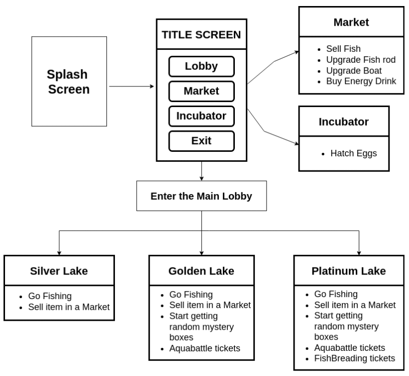

# Game Design and User Interface

AQUA SAGA combines the low-level game mechanics of AXIE INFINITY and FISHINGTON.

### How does the game derive inspiration from FISHINGTON?.

* Go for fishing and selling the fish that you caught in the market for earnings
* The users interact among themselves during fishing.

### **How does the game derive inspiration from AXIE INFINITY?**

* The fighter fish battles for earning the battle rewards.
* Breeding the fighter fish to get a new fighter fish.


_The given flow chart explains the game flow and the player’s progression through the user interface. There are five main screens in the game: **TITLE SCREEN, MAIN LOBBY, INCUBATOR,  MARKET,  LAKE LOBBY, SAGA LAKE, BATTLE ARENA.**_


From the main lobby, there will be three lake lobbies for the players to enter. Each will be connected to three different lakes - Saga Silver Lake, Saga Golden Lake, and Saga Platinum Lake. In the lobbies, the players will be berthing their boats, then entering the lobby where they can interact among themselves from where they will get to choose to go to the lake for fishing or to come out of the fishing area. Each lobby needs its respective tickets to enter. In the market, they can sell the fish and get paid in GEM tokens. Also, the boat and rod upgrade and buying the energy drinks can also be done in the market. Each player has a particular energy level at the beginning. The energy level of fishers gets reduced in accordance with the activity level. When the player gets their energy level reduced they can hurriedly increase their stamina by purchasing the energy drink from the market. During fishing, the players will be getting eggs from the quest boxes. These eggs can be hatched inside the incubators for a certain period of time.
